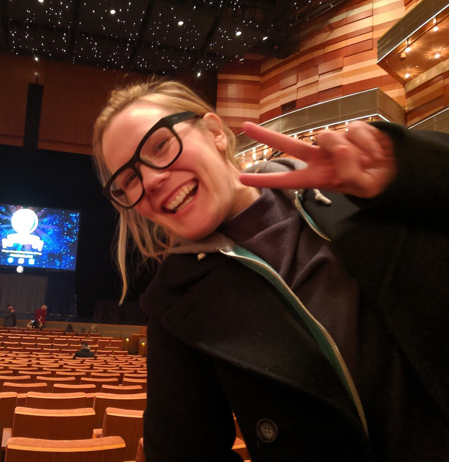

```{r echo=FALSE}
knitr::opts_chunk$set(echo = FALSE,message=FALSE,warning=FALSE)
```


# [**About me**](https://kelferdm.github.io/about-me) | [**Portfolio**](https://kelferdm.github.io/projects) | [**Resume**](https://kelferdm.github.io/resume/Resume_KM_2023.pdf){target="_blank"}

```{r, fig.align='right',out.width='400px',out.height='400px',out.extra='style="float:right; padding:10px"'}

```
