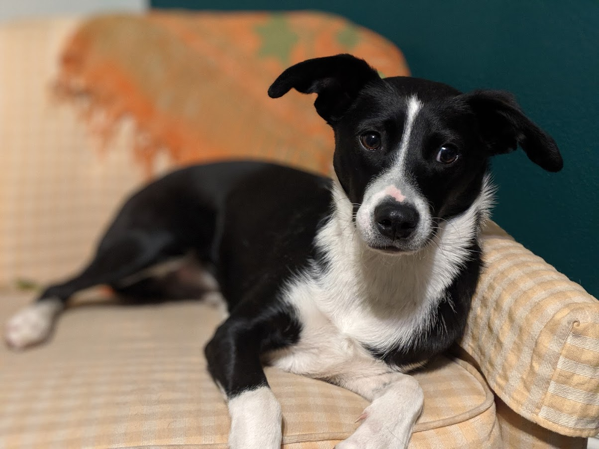

```{r echo=FALSE}
knitr::opts_chunk$set(echo = FALSE,message=FALSE,warning=FALSE)
```


# [**About me**](https://kelferdm.github.io/about-me) | [**Portfolio**](https://kelferdm.github.io/projects) | [**Resume**](https://kelferdm.github.io/resume/Resume_KM_2023.pdf){target="_blank"}


___

# Example data analysis projects:

<br><br><br>
```{r out.width='300px',out.height='250px'}

```


## [Utah Covid case analysis](./UT_covid.html)

<br><br><br>
```{r out.width='300px',out.height='250px'}

```

## [No-kill animal shelter analysis by county](./bestfriends.html)


